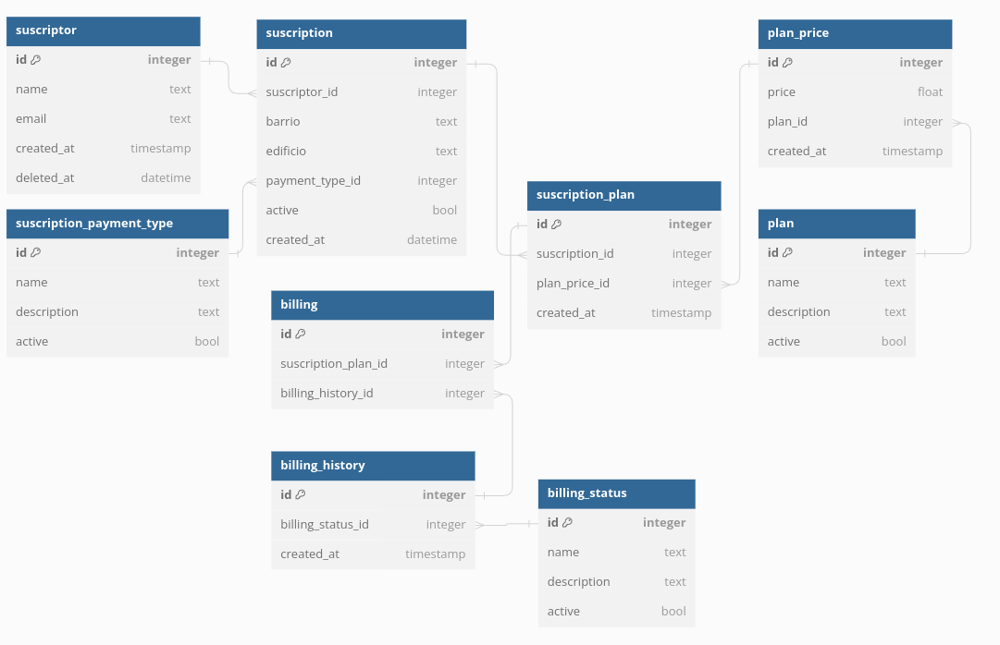

# Challenge esirneZ 

## Table of contents

- [Intro](#intro)
- [Setup environment](#setup-environment)
    - [Requirements](#requirements)
    - [Install](#Install)
        - [Clone repository](#clone-repository)
        - [Start project](#start-project)
        - [Check status](#check-status)
        - [Custom Domains](#custom-domains)
- [Database](#database)
- [Commands](#commands)


## Intro

See [Original requirements](docs/requirements.md)

Usado
- [Migrations](https://www.codeigniter.com/userguide2/libraries/migration.html) **(Feature disabled until problem is detected [See database](#database))**
- 

## Setup environment
### requirements
- GIT
- Docker
- Docker-compose or docker compose (v2)

(*) Validated in Linux based environments

### Install

#### Clone repository
```sh
mkdir -p ~/domains/challenge_esirnez
cd $_

git clone https://github.com/mmaximo33/challenge_esirnez ./
```

#### Start project
```sh
chmod +x bin/*

bin/docker up
```

#### Check status
Check the following urls
```sh
#App
http://localhost/

#Phpmyadmin
http://localhost:8080
```

#### Custom Domains
You can create a custom domain by replacing **mydomain.lcl** from the following command
```sh
grep -qxF '127.0.0.1 mydomain.lcl' /etc/hosts || echo "127.0.0.1 mydomain.lcl" | sudo tee -a /etc/hosts
```

## Database
Work was carried out on the implementation of migrations, but due to a problem not yet resolved, progress is being made with an alternative

To avoid wasting more time, the alternative of managing this through bash temporarily is used.

- [Migrations](https://www.codeigniter.com/userguide2/libraries/migration.html)
    - endpoint `http://localhost/migrate` **(Feature disabled until problem is detected)**
- Bash was used to manage the `bin/db` database [See Issue #2](https://github.com/mmaximo33/challenge_esirnez/issues/2#issuecomment-1930338993)



### Commands 

- `bin/docker`
```sh
bin/docker up                                 # Build containers
bin/docker start                              # Start containers
bin/docker stop                              # Stop containers
bin/docker allstop                          # Stop ALL containers and apache service
bin/docker restart                          # Restart containers
bin/docker logs                              # See logs containers
bin/docker removeproject              # Down containers and rm -rf ../{$PROJECT FOLDER}
```

- `bin/db`
```sh
bin/db clean        # Delete the current db and create a new one based on the .env data
bin/db schema       # Load the tables and schema
bin/db data         # Load basic data
bin/db demo         # Load demo data

bin/db all          # Perform the 3 actions mentioned before
```